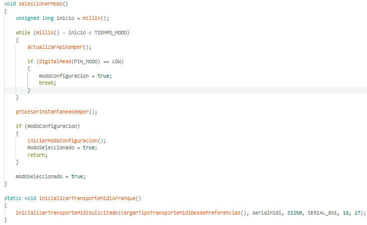
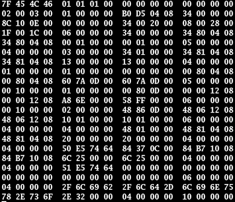

[REPOSITORIO MARINO VILLA](https://github.com/marinovilla/1DAMP_VillaValdes_Marino.git)

# EJERCICIO 01  

## ¿Qué es un programa informático?  

Un programa informático o programa de computadora es una captura de pantalla secuencia de instrucciones u órdenes basadas en un lenguaje de programación que una computadora interpreta para resolver un problema o una función específica. Este dispositivo requiere programas para funcionar, por lo general, ejecutando las instrucciones del programa en un procesador central.

## Diferencia entre código fuente, código objeto y código ejecutable.  

1. **Código Fuente:**  

   1.1 **Definición:** El código fuente es un archivo de texto que contiene el código escrito en un lenguaje de programación legible por humanos.  
   Este código está escrito en un lenguaje de programación específico, como C, C++, Java, Python, JavaScript, entre otros.  

   1.2 **Características:**  
   - **Legibilidad:** Está diseñado para ser leído y escrito por programadores.
   - **Ejemplo:** Un archivo con extensión `.c` para C, `.cpp` para C++, o `.java` para Java, contiene código fuente.    
      

2. **Código Objeto:**  

   2.1 **Definición:** El código objeto es una versión intermedia del código fuente que ha sido compilada a un formato binario, pero aún no es ejecutable directamente. Es el resultado de la compilación del código fuente antes de convertirse en código ejecutable.  

   2.2 **Características:**  
   - **Binario no ejecutable:** No puede ser ejecutado por sí mismo, pero puede ser enlazado para formar un archivo ejecutable.  
   - **Ejemplo:** En C o C++, el archivo con extensión .o (objeto) o .obj contiene el código objeto. Java: En Java, el código objeto se denomina ByteCode y se guarda en archivos con extensión .class.  

3. **Código Ejecutable:**  
   3.1 **Definición:** El código ejecutable es un archivo binario que puede ser ejecutado directamente por el sistema operativo. Este archivo es el resultado final de la compilación (y, en algunos casos, el enlace) del código fuente.
   3.2 **Características:**  
   - **Binario ejecutable:** Puede ser ejecutado por la máquina sin necesidad de compilar o interpretar más.
   - **Ejemplo:** En sistemas Windows, es un archivo con extensión .exe. En sistemas Unix-like, es un archivo sin extensión específica, como el archivo binario en el directorio /usr/bin/.   
       

## Etapas del desarrollo del software. 

El desarrollo de software se divide en una serie de etapas, cada una con sus propios objetivos y tareas. Las etapas más comunes del desarrollo de software son las siguientes:  

1. **Planificación** es la etapa inicial del desarrollo de software. En esta etapa, se definen los objetivos del proyecto, se recopilan los requisitos del usuario y se desarrolla un plan de proyecto.  
2. **Análisis** es la etapa en la que se investigan los requisitos del usuario. En esta etapa, se entrevistan a los usuarios, se realizan encuestas y se recopilan datos para comprender las necesidades del usuario.  
3. **Diseño** es la etapa en la que se crea un plan para el software. En esta etapa, se definen los componentes del software, la arquitectura del software y la interfaz de usuario.  
4. **Programación** es la etapa en la que se escribe el código del software. En esta etapa, los desarrolladores utilizan lenguajes de programación para crear el software según el diseño.  
5. **Pruebas** son la etapa en la que se verifica que el software cumpla con los requisitos del usuario. En esta etapa, se realizan pruebas funcionales, pruebas de rendimiento y pruebas de seguridad.  
6. **Implementación** es la etapa en la que se pone el software en funcionamiento. En esta etapa, se instala el software en los sistemas informáticos de los usuarios.  
7. **Mantenimiento** es la etapa en la que se corrigen los errores del software y se realizan mejoras. En esta etapa, se realizan actualizaciones del software para corregir errores, agregar nuevas características o mejorar el rendimiento.    

### Bibliografía:  

[WIKIPEDIA](https://es.wikipedia.org/wiki/Programa_inform%C3%A1tico), [Asignatura: Matemáticas II, José Rodríguez](https://www.studocu.com/es/document/instituto-de-educacion-secundaria-poligono-sur/matematicas-ii/13codigos-fuente-objeto-y-ejecutable/104853597?sid=89192f87-e752-411f-b075-f1b7b43b460d1790016119), [WEB CERTUS](https://www.certus.edu.pe/blog/las-etapas-del-desarrollo-de-software/)
